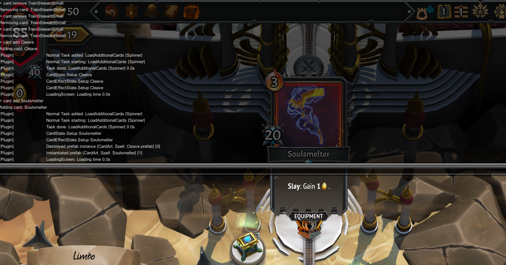

# Stoker



A powerful cheat manager and console for Monster Train 2.

## Features

- In-game console with command completion
- Command history navigation
- Real-time command suggestions
- Support for subcommands and options
- Customizable command system
- Log viewer with different message types (Info, Warning, Error)
- Fluent API for easy command creation

## Installation

1. Install [BepInEx](https://github.com/BepInEx/BepInEx) for your game
2. Install [Trainworks]()
3. Place the Stoker plugin in the `BepInEx/plugins` directory
4. Start the game

## How to Use

### Opening the Console
- Press the backtick key (`) to toggle the console

### Basic Usage
- Type commands and press Enter to execute them
- Use Up/Down arrows to navigate command history
- Press Tab to cycle through command completions
- Press Shift+Tab to cycle backwards through completions

### Command Structure
Commands follow this general structure:
```
command [subcommand] [options] [arguments]
```

### Available Commands

#### Help Command
```
help
```
Displays a list of all available commands and their descriptions.

#### Echo Command
```
echo <message>
```
Echoes back the provided message.

#### Card Commands
```
card add <card_name> [options]
card remove <card_name> [options]
```
Manage cards in the game.

#### Gold Command
```
gold <amount>
```
Add or remove gold. The amount can be positive or negative.

#### Relic Commands
```
relic add <relic_name> [options]
```
Add relics to your collection.

## Command Completion

The console features intelligent command completion:
- Press Tab to cycle through available completions
- Completions are shown in semi-transparent gray
- Suggestions update in real-time as you type
- Supports completing:
  - Command names
  - Subcommands
  - Option names
  - Option values
  - Argument values

## Development

### Using the Fluent API

The Fluent API provides a clean, readable way to create commands. Here are some examples from the codebase:

#### Basic Command
```csharp
var command = new CommandBuilder("echo")
    .WithDescription("Echo a message")
    .WithArgument<string>("message")
        .WithDescription("The message to echo")
        .WithParser((xs) => xs)
        .Parent()
    .SetHandler((args) => {
        if (!args.Arguments.ContainsKey("message"))
            throw new Exception("Missing <message> argument");
        var message = args.Arguments["message"];
        if (message is null)
            return Task.CompletedTask;
        Plugin.Logger.LogInfo(message.ToString());
        return Task.CompletedTask;
    })
    .UseHelpMiddleware();
```

#### Command with Options
```csharp
var command = new CommandBuilder("gold")
    .WithDescription("Manage gold")
    .WithArgument<string>("amount")
        .WithDescription("The amount of gold to add")
        .WithParser((xs) => xs)
        .WithDefaultValue("100")
        .WithSuggestions(() => ["100", "+100", "-100"])
        .Parent()
    .SetHandler((args) => {
        var arguments = args.Arguments;
        if (!arguments.ContainsKey("amount"))
            throw new Exception("Missing <amount> argument");
        if (arguments["amount"] is not string amount)
            throw new Exception("Invalid <amount> argument");
        Plugin.Logger.LogInfo($"Adding {amount} gold to the player");
        AccessTools.Method(typeof(CheatManager), "Command_AdjustGold").Invoke(null, [amount]);
        return Task.CompletedTask;
    })
    .UseHelpMiddleware();
```

#### Command with Subcommands
```csharp
var command = new CommandBuilder("card")
    .WithDescription("Manage cards")
    .WithSubCommand("add")
        .WithDescription("Add a card to the deck")
        .WithArgument<string>("name")
            .WithDescription("The name of the card to add")
            .WithSuggestions(() => [.. Railend.GetContainer().GetInstance<IRegister<CardData>>()
                .GetAllIdentifiers(RegisterIdentifierType.ReadableID)
                .Select(c => c.ToString())])
            .WithParser((xs) => xs)
            .Parent()
        .SetHandler((args) => {
            var arguments = args.Arguments;
            if (!arguments.ContainsKey("name"))
                throw new Exception("Missing <name> argument");
            if (arguments["name"] is not string cardName)
                throw new Exception("Invalid <name> argument");
            Plugin.Logger.LogInfo($"Adding card: {cardName}");
            CheatManager.Command_AddCard(cardName);
            return Task.CompletedTask;
        })
        .UseHelpMiddleware()
        .Parent();
```

### Adding New Commands (In-Depth)

To add a new command, you can either use the Fluent API (recommended) or implement the `ICommand` interface directly for more control:

```csharp
public class MyCommand : ICommand
{
    public string Name => "mycommand";
    public string Description => "My command description";
    
    public void AddArgument(IArgument argument) { /* ... */ }
    public void AddOption(ICommandOption option) { /* ... */ }
    public void AddSubCommand(ICommand subCommand) { /* ... */ }
    public void SetHandler(Func<HandlerArgs, Task> handler) { /* ... */ }
    public Task ExecuteAsync(string[] args) { /* ... */ }
    public string[] GetCompletions(string[] args) { /* ... */ }
}
```

### Command Options
Commands can have options with:
- Required/optional flags
- Default values
- Aliases
- Value suggestions
- Custom parsers

### Arguments
Commands can have positional arguments with:
- Required/optional flags
- Default values
- Value suggestions
- Custom parsers

## License

This project is licensed under the MIT License - see the LICENSE file for details. 